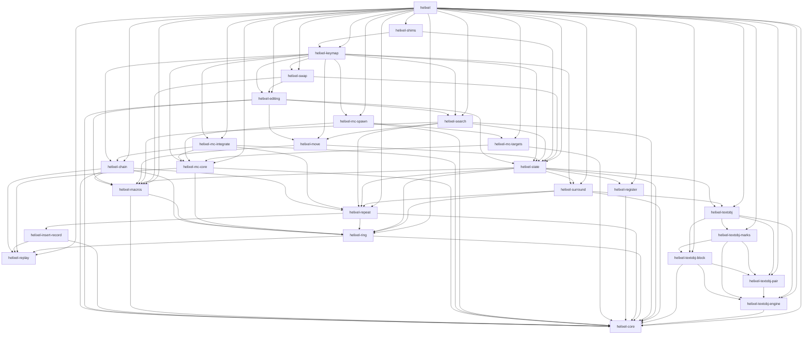

# helixel-mode dependency graph

Auto-generated by `scripts/gen-depgraph.el`.
Do not edit by hand; run `make depgraph' to refresh.

```mermaid
graph TD
  helixel-chain --> helixel-core
  helixel-chain --> helixel-ring
  helixel-chain --> helixel-macros
  helixel-chain --> helixel-repeat
  helixel-chain --> helixel-replay
  helixel-editing --> helixel-state
  helixel-editing --> helixel-move
  helixel-editing --> helixel-core
  helixel-editing --> helixel-macros
  helixel-editing --> helixel-search
  helixel-insert-record --> helixel-core
  helixel-insert-record --> helixel-replay
  helixel-keymap --> helixel-state
  helixel-keymap --> helixel-move
  helixel-keymap --> helixel-editing
  helixel-keymap --> helixel-chain
  helixel-keymap --> helixel-surround
  helixel-keymap --> helixel-swap
  helixel-keymap --> helixel-search
  helixel-keymap --> helixel-mc-core
  helixel-keymap --> helixel-mc-spawn
  helixel-keymap --> helixel-mc-integrate
  helixel-macros --> helixel-core
  helixel-macros --> helixel-ring
  helixel-mc-core --> helixel-core
  helixel-mc-core --> helixel-replay
  helixel-mc-core --> helixel-ring
  helixel-mc-integrate --> helixel-core
  helixel-mc-integrate --> helixel-mc-core
  helixel-mc-integrate --> helixel-repeat
  helixel-mc-integrate --> helixel-chain
  helixel-mc-spawn --> helixel-core
  helixel-mc-spawn --> helixel-mc-core
  helixel-mc-spawn --> helixel-mc-targets
  helixel-mc-targets --> helixel-core
  helixel-mc-targets --> helixel-mc-core
  helixel-move --> helixel-state
  helixel-move --> helixel-macros
  helixel-register --> helixel-core
  helixel-repeat --> helixel-core
  helixel-repeat --> helixel-ring
  helixel-repeat --> helixel-insert-record
  helixel-ring --> helixel-core
  helixel-ring --> helixel-replay
  helixel-search --> helixel-state
  helixel-search --> helixel-core
  helixel-search --> helixel-macros
  helixel-search --> helixel-repeat
  helixel-search --> helixel-move
  helixel-shims --> helixel-state
  helixel-shims --> helixel-keymap
  helixel-state --> helixel-core
  helixel-state --> helixel-ring
  helixel-state --> helixel-macros
  helixel-state --> helixel-register
  helixel-state --> helixel-repeat
  helixel-state --> helixel-textobj
  helixel-state --> helixel-surround
  helixel-surround --> helixel-core
  helixel-surround --> helixel-ring
  helixel-surround --> helixel-repeat
  helixel-surround --> helixel-textobj
  helixel-swap --> helixel-state
  helixel-swap --> helixel-macros
  helixel-swap --> helixel-editing
  helixel-textobj-block --> helixel-core
  helixel-textobj-block --> helixel-textobj-engine
  helixel-textobj-block --> helixel-textobj-pair
  helixel-textobj-engine --> helixel-core
  helixel-textobj-marks --> helixel-textobj-engine
  helixel-textobj-marks --> helixel-textobj-pair
  helixel-textobj-marks --> helixel-textobj-block
  helixel-textobj-pair --> helixel-textobj-engine
  helixel-textobj --> helixel-textobj-engine
  helixel-textobj --> helixel-textobj-pair
  helixel-textobj --> helixel-textobj-block
  helixel-textobj --> helixel-textobj-marks
  helixel --> helixel-core
  helixel --> helixel-replay
  helixel --> helixel-ring
  helixel --> helixel-macros
  helixel --> helixel-register
  helixel --> helixel-repeat
  helixel --> helixel-chain
  helixel --> helixel-state
  helixel --> helixel-search
  helixel --> helixel-editing
  helixel --> helixel-textobj-engine
  helixel --> helixel-textobj-pair
  helixel --> helixel-textobj-block
  helixel --> helixel-textobj-marks
  helixel --> helixel-textobj
  helixel --> helixel-surround
  helixel --> helixel-swap
  helixel --> helixel-keymap
  helixel --> helixel-mc-core
  helixel --> helixel-mc-targets
  helixel --> helixel-mc-spawn
  helixel --> helixel-mc-integrate
  helixel --> helixel-shims
```
